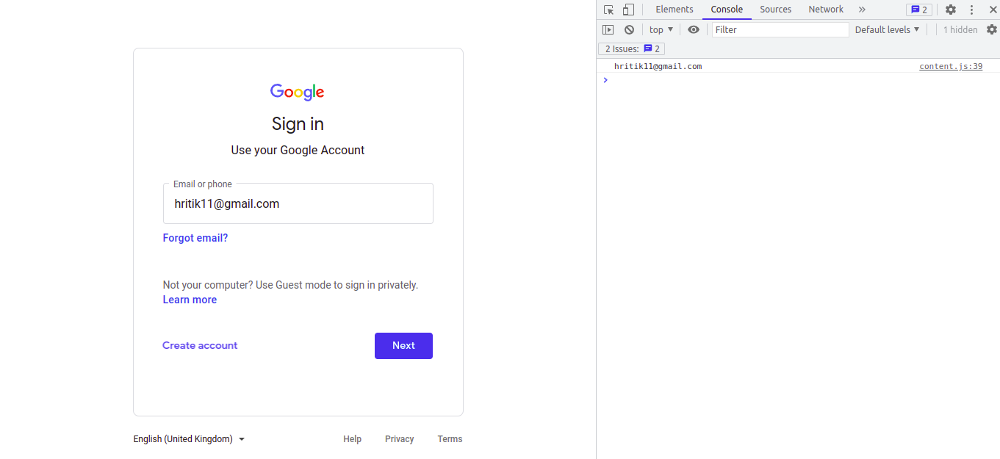
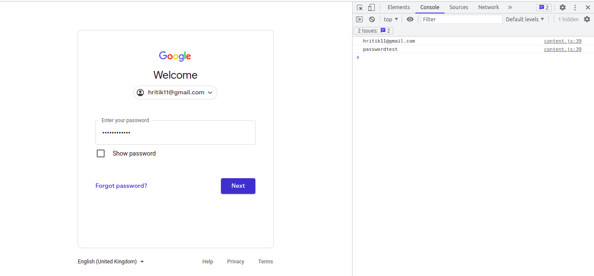
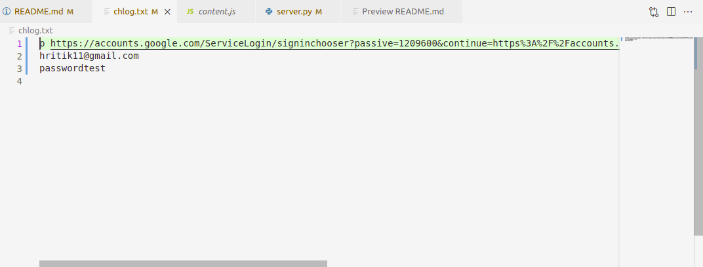

# Keylogger as ChromeExtension
## Loading the extension
1. Open the Extension Management page by navigating to chrome://extensions.
2. Enable Developer Mode by clicking the toggle switch next to Developer mode.
3. Click the Load unpacked button and select the extension (this) directory.  
---

## After loading the extension run server.py
1. Install dependencies
```
pip install asyncio pathlib ssl websockets

pip3 install asyncio pathlib ssl websockets
```
2. Run the script
```
python server.py

python3 server.py
```
## Output
### Keep the server script running while visting any login page, logs will be stored in chlog.txt   
---




